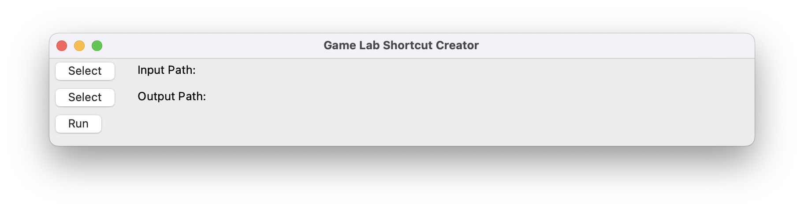
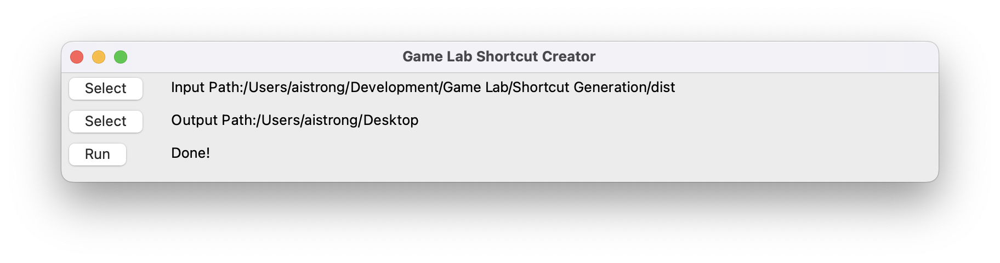

# UCLA Game Lab Shortcut Generation

_Original Author: Aidan Strong (aidan.m.strong@gmail.com)_

_October 2023_

## To Compile
To compile you must have Python installed and the following libraries:
- `pyinstaller`
- `PyQt5`
  
Both of which can both be installed via `pip`

The following command will be used for creating the executable:

`pyinstaller --onefile --hide-console minimize-early --icon=logo.ico shortcut.py`

It will create a `.app` file if run on a **OSX** computer, and a `.exe`
on a **WINDOWS** computer.

The command will create the application inside of `/dist`, which can be taken out of the folder and distributed.

## To Use

The program can be taken out of the `dist` folder and ran anywhere.

Once ran, it will open the following window:

Click on the `Select` buttons and pick an input (the root folder containing all the projects) / output path (where to dump all the shortcuts)

Once you have the folders selected click `Run`, and the program will execute!

You should see a "Done" mesesage when it completes. If a "Done" message does not show and the program closes, and error has occured.

## Notes
Windows Defender seems to consider running the `.exe` creation command to be a Trojan virus. It is not, and you can open Windows Defender and allow the app to execute regardless.